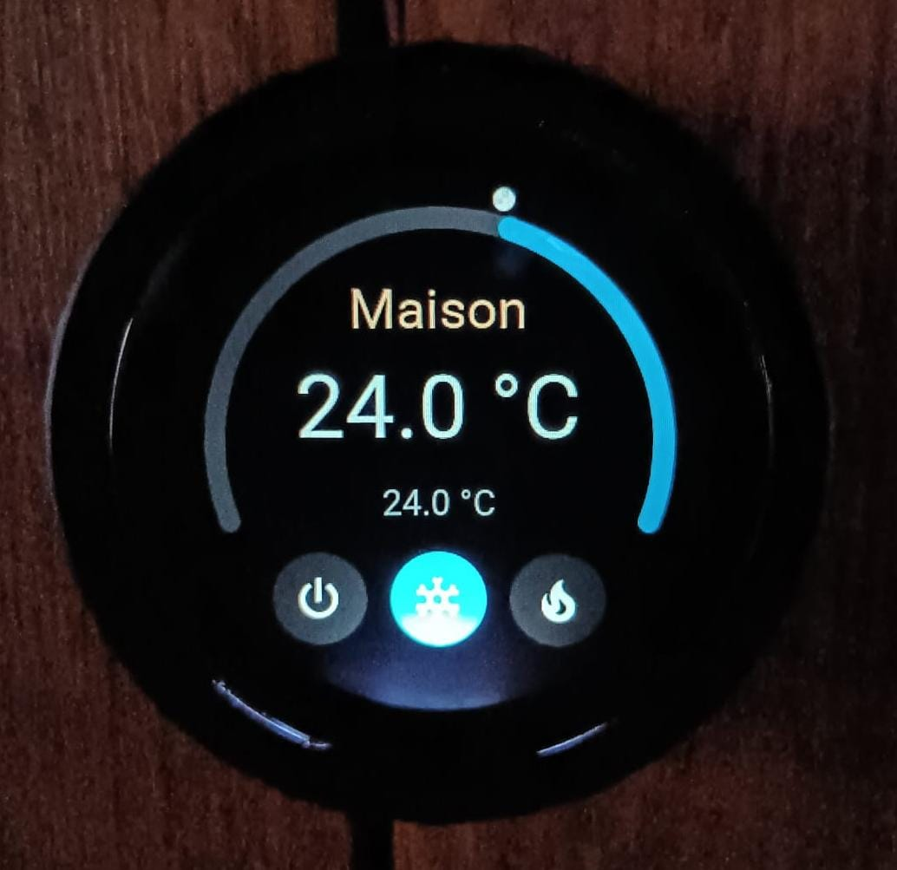

# 🌡️ Multi-Zone Thermostat for Waveshare ESP32-S3 Knob Touch LCD 1.8"

---

## 🇫🇷 Thermostat Multi-Zones pour Waveshare ESP32-S3 Knob Touch LCD 1.8"

Un thermostat **multi-zones** (jusqu'à 8 zones) pour le **Waveshare ESP32-S3 Knob Touch LCD 1.8"**, intégré avec **Home Assistant** via **ESPHome**.
Idéal pour contrôler la température de chaque pièce de votre maison avec une interface tactile intuitive.

🔹 **Fonctionnalités clés** :

✅ **8 zones indépendantes** (navigables par swipe gauche/droite en boucle).

✅ **Contrôle par molette rotative** (réglage précis de la consigne).

✅ **Veille automatique** :
   - Extinction du rétroéclairage après **30 secondes d'inactivité**.
   - Passage en **veille profonde** après **3 minutes**

✅ **Affichage clair** : Température actuelle, consigne, et mode (Chauffage/Climatisation/Off).

✅ **Compatibilité** : Fonctionne avec n'importe quel climatiseur ou chauffage connecté à Home Assistant.

✅ Timer 15 - 240min (swipe haut/bas)

✅ **Économie d'énergie** : Utilisation du **deep sleep** pour prolonger l'autonomie (jusqu'à plusieurs mois avec une batterie LiPo).

🔹 **Matériel requis** :
 | Composant | Lien | Quantité |
 |-----------|------|----------|
 | **Waveshare ESP32-S3 Knob Touch LCD 1.8"** | [Acheter ici](https://www.waveshare.com/esp32-s3-knob-touch-lcd-1.8.htm?sku=34875) | 1 |
 | **Batterie LiPo 3.7V** (ex: 18650) | Optionnel | 1 |
 | **Câble USB-C** | Pour le flashing | 1 |

🔹 **Dépendances** :
- [ESPHome](https://esphome.io/) (version ≥ 2026.8.1).
- [Component WaveShare-Knob-Esp32S3](https://github.com/KrX3D/WaveShare-Knob-Esp32S3) (inclus via `external_components`).
- **Home Assistant** (pour l'intégration des capteurs et climatiseurs).

🔹 **Crédits** :
- Développement initial avec l'aide de **ChatGPT**, **Claude**  et **Vibe (Mistral AI)**
- optimisation de la veille : [svwhisper/lyngdorf-secondary-sleep](https://github.com/svwhisper/lyngdorf-secondary-sleep) (pour flasher le second ESP et gagner en autonomie).

---

### 🛠️ Installation

#### 1️⃣ Prérequis
- **ESPHome** configuré dans Home Assistant.
- Les **entités Home Assistant** pour chaque zone (ex: `climate.salon`, `sensor.temperature_chambre`).

#### 2️⃣ Configuration
1. **Téléchargez** le fichier [`thermostat-multizone.yaml`](thermostat-multizone.yaml).
2. **Personnalisez** les entités dans le YAML :
   - Remplacez `climate.zone0` par votre entité climatiseur (ex: `climate.salon`).
   - Remplacez `sensor.zone0` par votre capteur de température (ex: `sensor.temperature_salon`).
   - Répétez pour les **8 zones**.
   - flasher les ESP
   - Ajouter le thermostat à Home Assistant via l'intégration ESPHome
3. **Créez script et automation** de veille / timer
4. **Ajoutez le sensor** à votre fichier configuration.yaml
